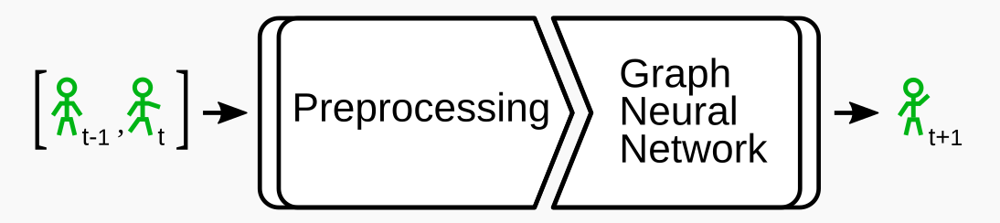
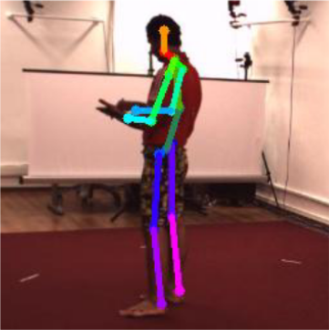
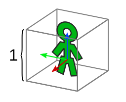
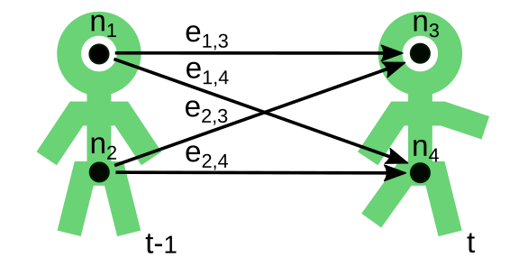
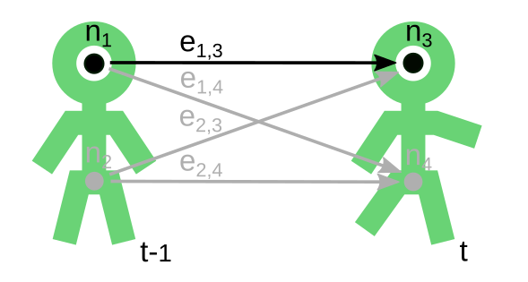
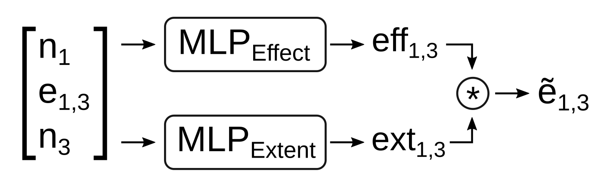
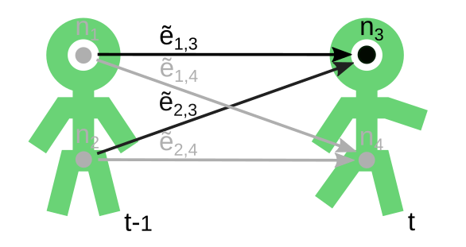
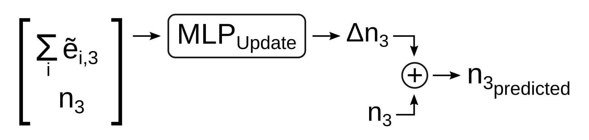

# Pose Graph Tracking

The purpose of this package is to track humans represented by pose graphs.  
In its current state, it predicts the next pose of a human given the current and the previous pose.  
This procedure can be applied sequentially to predict the poses following the next pose.  

The prediction step is planned to be part of a [Multi Object Tracking (MOT) pipeline](https://github.com/AIS-Bonn/multi_hypothesis_tracking).  
The MOT pipeline consists of:
1) a prediction step per tracked object 
2) an association step to correct the predictions using current data.
---
## Current State

The package consists of a Graph Neural Network (GNN) utilizing the previous and the current human pose graphs to predict the next human pose graph.  

Figure 1: Pipeline overview.

In the following the pipeline is described in detail. 

<b>Input Data</b>

The input pose graphs are generated from images of multiple cameras observing the same humans.  
The [Human3.6M data set](http://vision.imar.ro/human3.6m/description.php) provides such data for single humans and ground truth pose annotations.  
The images from the data set are processed using the [SmartEdgeSensor3DHumanPose](https://github.com/AIS-Bonn/SmartEdgeSensor3DHumanPose) package to generate human pose graphs.

Figure 2: Exemplary generated human pose graph projected into an image from the Human3.6M data set.
Image source: [Real-Time Multi-View 3D Human Pose Estimation using Semantic Feedback to Smart Edge Sensors](https://www.ais.uni-bonn.de/papers/RSS_2021_Bultmann.pdf)

<b>Data Preprocessing</b>

Currently, two sequential poses of the same human are used as the input.  
The poses are normalized with respect to the first pose.  
Meaning, a normalization transformation is computed for the first pose and applied to every pose in the sequence.  

The assumptions in our use case are that the prediction of a single human is independent of:
1) the global frame - e.g. a walking motion doesn't depend on the direction of walking or the exact spot in the room
2) the height of the human - a tall person's walking motion is very similar to the walking motion of a smaller person  
  
These assumptions and the corresponding normalization allow the network to concentrate on learning how to predict a motion.  
The network doesn't need to know how to predict the motion in every different setup for every different human.   

To address assumption 1, the normalization applies a translation and rotation is such a way that:
- the mid hip position is in the origin of the local coordinate frame
- and the front of the hip is facing in the x-direction (Fig. 3)
  - this is achieved by rotating the pose around the z-axis only

To address assumption 2, the height of the human is estimated by summing the bone lengths from one leg, the spine, the neck and the head.  
The pose is scaled by dividing it with the estimated height - resulting in a height of 1 (Fig. 3).  

Figure 3: Visualization of a normalized pose.

<b>Graph Neural Network</b>

---

#### Graph Neural Network in General

Remark: If you are new to Graph Neural Networks a good introduction can be found on [distill.pub](https://distill.pub/2021/gnn-intro/).

The task of the Graph Neural Network (GNN)  in our use case is to predict the next pose of a human given the previous poses.  
The assumption is that every joint can have an effect on every other joint.  
E.g. while walking, the right hand does not only move with respect to the right elbow but is also moving antagonistically to the left hand.  

--- 

#### Constructing the Input Graph

A GNN can only modify the node and edge features of one graph.  
Thus, the first thing to do is to construct one graph from the sequence of poses.  
For that every joint becomes one a node ni in the graph.  
To incorporate the assumption, every node ni from the previous pose at time step t-1 is connected to every node nj from the current pose at time step t via a directed edge ei,j (Fig. 4).  

Figure 4: A simplified example graph with only two joints per pose.

Every node and every edge can have an associated feature vector - e.g. joint position as node feature.  
The GNN updates all edge features, but only features of nodes with incoming edges.  
It's task will be to update the node positions from time step t to generate a prediction for time step t+1. 

---

#### Edge Update

The GNN updates the edge features first.  
Each edge is updated in the same way using the same set of MLPs.  
For every edge ei,j:
- Concatenate the features of the connected nodes ni & nj - e.g. positions - and the features of the edge - e.g. distance between nodes
- Use an MLP to estimate the effect *effi,j* of the source node ni onto the target node nj 
- Use an MLP to estimate the extent of the effect *exti,j* of the source node ni onto the target node nj 
- Multiply the effect and the extent to get the updated edge feature ẽi,j (Fig. 5)

 

Figure 5: Visualization of the graph and the submodules involved in the edge update for edge e1,3.

---

#### Node Update

After updating all edge features the node features are updated in a similar fashion.  
The main difference is that there can be a varying number of incoming edges to each node.  
This is addressed by an aggregation function combining the features of all incoming edges per node.  
Again, every node is updated in the same way using the same MLP.  

For every node nj from time step t:
- Sum up the updated feature vectors of every incoming edge - representing how other joints affect this joint
- Concatenate the summed feature vector with the feature vector of the node itself
- Use an MLP to estimate how the node should be updated
- Add the result to the node state from time step t to get the predicted state (Fig. 6)

Figure 6: Visualization of the graph and the submodules involved in the node update for node n3.

<b>Model Variants</b>

After describing the utilized Graph Neural Network (GNN) in general, several tested variants are described in the following.  
For all variants, each node feature is encoded using the same MLP before being passed into the GNN.  
The same is done with the edge features using a different MLP.  
We noticed that the GNN is performing better with encoded features.  
After predicting the node features of the next time step an MLP is used on the node features to decode them back into the euclidean space.  

The variants mostly differ in the way the data is presented to the GNN.  
Starting from the initial prototype, the input is adapted step by step to a homogeneous GNN - described above - that is compared to a heterogeneous GNN.  
The heterogeneous GNN differs by allowing to specify a type for each edge and node.  
Depending on the edge type a different set of MLPs is used and trained during the edge update.  
Edges of the same type use the same MLPs.  
The target node type defines the MLP used in the node update equivalently.  

__Model 1 - The Initial Prototype__

For the initial prototype each node feature vector consisted of the normalized 3D position of the corresponding joint and the specific node id, normalized to a range from -1.0 to 1.0.  
Each edge feature consisted of the difference between the normalized target and source joint positions.  

node_featuresj = [normalized(j), positionj,t]  
edge_featuresi,j = [positionj,t - positioni,t-1]

The reasoning behind this is that the node feature encoder gets the option to encode the node positions depending on the node id.  
The edge feature encoder could transform the features into an equivalent latent space.  
The edge update gets the information about the connected nodes' ids, their positions and already their difference in the latent space.  
The node update gets the information about the node's id, its position and how the edges affect the node. 
And the decoder just serves to transform from the latent to euclidean space. 

__Model 2 - The Corrected Prototype__

The corrected prototype differs to the initial prototype in the joint id within the node features.  
Here, the joint id is encoded as a one hot vector.

node_featuresj = [one_hot_encoded(j), positionj,t]  
edge_featuresi,j = [positionj,t - positioni,t-1]

The reasoning is the same as for the initial prototype. 

__Model 3 - The One Hot Encoded Edge Model__

For this model, the joint ids are encoded in the edge features.  
The combination of source and target node ids is encoded in a one hot vector.  
Each node feature consists of the corresponding joints' normalized 3D position from time step t and t-1.  

node_featuresj = [positionj,t-1, positionj,t]  
edge_featuresi,j = [one_hot_encoded(i, j)]

The reasoning behind it is to separate the features by their domain.  
The node features are in the euclidean space and get encoded by the node feature encoder independently of their id.  
The edge encoder only gets the ids and could potentially steer the edge update depending on the ids.  
The node update on the other hand has to rely on the information from the updated edges, because it gets no information about the target node id from the encoded node features.  

A potential downside of this model is the combinatorial explosion of the joint id combinations encoded in the edges. 

__Model 4 - The No Initial Edge Features Model__

This model is similar to model 2.  
The difference is that the initial edge features are omitted and the node features are extended by the previous position of the corresponding joint.  
Therefore, the node features consist of the one hot encoded node id, the previous and the current position of the joint.  

node_featuresj = [one_hot_encoded(j), positionj,t-1, positionj,t]  
edge_featuresi,j = []

The reasoning here is that the model should easily be capable of computing the edge features of model 2 by itself in the edge update - if this would be of use.  
The input to the edge update still consists of the encoded ids and all positions of the source and target node. 
The potential upside to model 3 would be that the target node id is encoded in the node features.

__Model 5 - The Heterogeneous GNN Model__

This model is most closely comparable to model 3 and 4. 
Like in model three, the initial edge features are empty.  
Like in model four, the node features consist of the previous and current positions of the corresponding joint.  
The node ids define the node types.  
Similar to model three each node id combination defines an edge type. 

node_featuresj = [positionj,t-1, positionj,t]  
edge_featuresi,j = []

This way, each joint combination is processed by an own set of MLPs during the edge update.  
The MLPs have the same size but unique sets of weights.  
Similarly, each target node type gets an own MLP for the node update.  
Encoder and decoder are not affected by the types.  

<b>Training</b>

The models are trained on the Human3.6M data set.  
3D Poses are estimated on the image data.  
Noise is applied to the training data to prevent overfitting and increase the robustness of the model.  
The noise is added to the joint positions.  
The amount of noise is sampled randomly from a uniform distribution between -n and n, with n being 5% of the link length the joint is connected by.  
The noisy estimated poses serve as the input to the model.  
The Mean Squared Error (MSE) between the normalized predicted joint positions and the normalized ground truth is used as the loss.  
Adam is utilized as the optimizer with a learning rate of 0.001.

<b>Intermediate Results</b>

TODO: insert gifs for qualitative results 

TODO: describe evaluation and evaluated model variants - insert schematic image per variant 

TODO: add links to branches containing the variants

